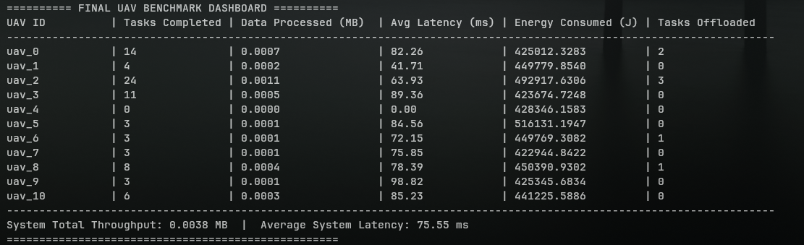

# iFogSim FANET Simulation with PPO Agent

This repository contains an iFogSim-based simulation of a Flying Ad-Hoc Network (FANET), integrated with a Python-based PyTorch Proximal Policy Optimization (PPO) agent. This project represents a terrestrial Mobile Edge Computing (MEC) simulation designed to benchmark the system proposed in "A Multi-UAV Cooperative Task Scheduling in Dynamic Environments: Throughput Maximization" (Zhao et al., 2025).



## Architecture & Workflow

The simulation utilizes a strict role separation architecture between the Java environment and the Python AI server:

1. **Java Simulation (iFogSim & MOGS Scheduling)**: Exclusively handles task generation, data transmission, and the **Many-to-One Gale-Shapley (MOGS)** task scheduling algorithm. It simulates the strict terrestrial MEC model with no centralized Cloud infrastructure.
2. **Python PPO Server**: Exclusively handles UAV flight trajectory and formation control using a PyTorch-based PPO agent following a Centralized Training with Decentralized Execution (CTDE) framework. It periodically receives global state via TCP and computes optimal trajectories, but **does not** dictate task assignments.

## Requirements & Setup

### Java (Simulation Environment)
- Java 8 (JRE 1.8)
- External libraries inside the `jars` folder. If importing into IntelliJ IDEA or Eclipse, ensure the JARs are added to the project's build path/library dependency list.

### Python (PPO Server)
- Python 3.8 or higher is recommended.
- Install the required Machine Learning and environment dependencies:
```bash
pip install -r requirements.txt
```

## Running the Simulation

**Step 1. Start the PPO Server**
Navigate into the `ppo_agent` directory and start the Python server.
```bash
cd ppo_agent
python fanet_ppo_server.py
```
The server will boot up and start listening on port `5500` (TCP socket).

**Step 2. Start the Java Simulation**
Run the main FANET simulation class located at:
`src/org/fog/test/perfeval/FANETSimulation.java`
Upon starting, the Java simulation connects to `localhost:5500`. The Java side periodically sends the global state (UAV positions, queues, energy) to Python, which computes next geographic targets and sends them back. When task batches reach a threshold, Java executes the MOGS matching algorithm to route tasks.


---

### Legacy iFogSim2 README
 A Toolkit for Modeling and Simulation of Resource Management Techniques in Internet of Things, Edge and Fog Computing Environments with the following new features:
 * Mobility-support and Migration Management
   * Supporting real mobility datasets
   * Implementing different random mobility models 
 * Microservice Orchestration
 * Dynamic Distributed Clustering
 * Any Combinations of Above-mentioned Features
 * Full Compatibility with the Latest Version of the CloudSim (i.e., (https://github.com/Cloudslab/cloudsim/releases)) and [Previous iFogSim Version](https://github.com/Cloudslab/iFogSim1) and Tutorials

iFogSim2 currently encompasses several new usecases such as:
 * Audio Translation Scenario
 * Healthcare Scenario
 * Crowd-sensing Scenario

# References
 * Redowan Mahmud, Samodha Pallewatta, Mohammad Goudarzi, and Rajkumar Buyya, <A href="https://arxiv.org/abs/2109.05636">iFogSim2: An Extended iFogSim Simulator for Mobility, Clustering, and Microservice Management in Edge and Fog Computing Environments</A>, Journal of Systems and Software (JSS), Volume 190, Pages: 1-17, ISSN:0164-1212, Elsevier Press, Amsterdam, The Netherlands, August 2022.
 * Harshit Gupta, Amir Vahid Dastjerdi , Soumya K. Ghosh, and Rajkumar Buyya, <A href="http://www.buyya.com/papers/iFogSim.pdf">iFogSim: A Toolkit for Modeling and Simulation of Resource Management Techniques in Internet of Things, Edge and Fog Computing Environments</A>, Software: Practice and Experience (SPE), Volume 47, Issue 9, Pages: 1275-1296, ISSN: 0038-0644, Wiley Press, New York, USA, September 2017.
 * Redowan Mahmud and Rajkumar Buyya, <A href="http://www.buyya.com/papers/iFogSim-Tut.pdf">Modelling and Simulation of Fog and Edge Computing Environments using iFogSim Toolkit</A>, Fog and Edge Computing: Principles and Paradigms, R. Buyya and S. Srirama (eds), 433-466pp, ISBN: 978-111-95-2498-4, Wiley Press, New York, USA, January 2019.
